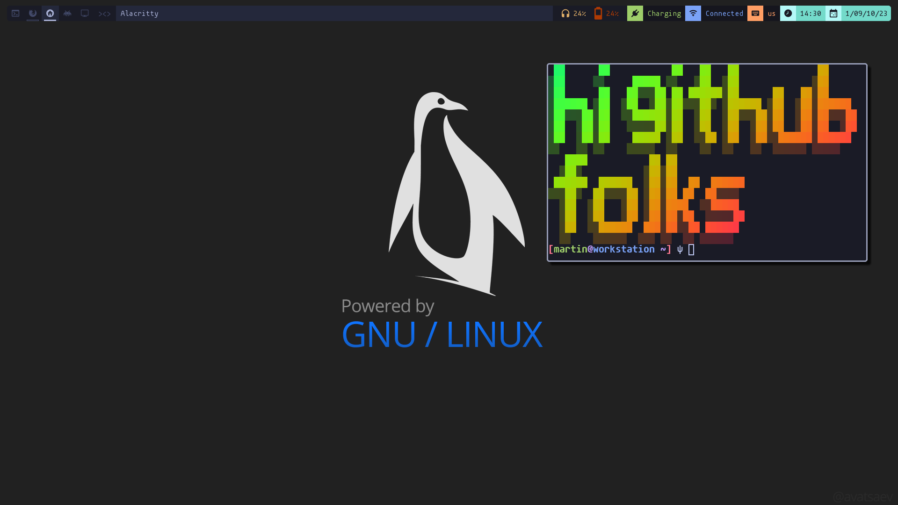

# How to install it
`git clone` this project and run `sudo make clean install` in the project folder
# Road map
- [ ] Fixing a certain "..." bug
- [ ] adding a second bar maybe (most likely it will be done via eww)
- [ ] adding conky (for system information)
- [ ] reworking keybindings

# Picture

